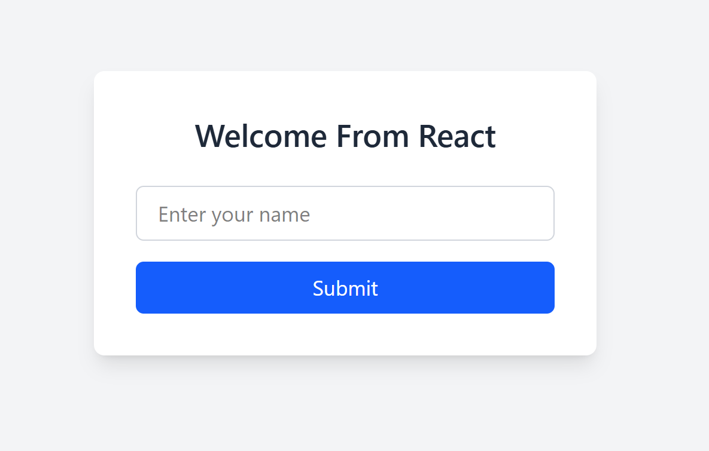
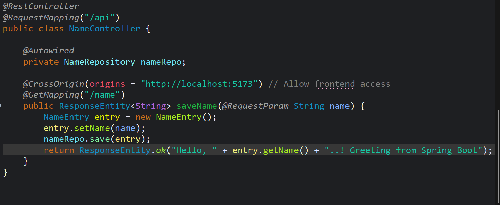
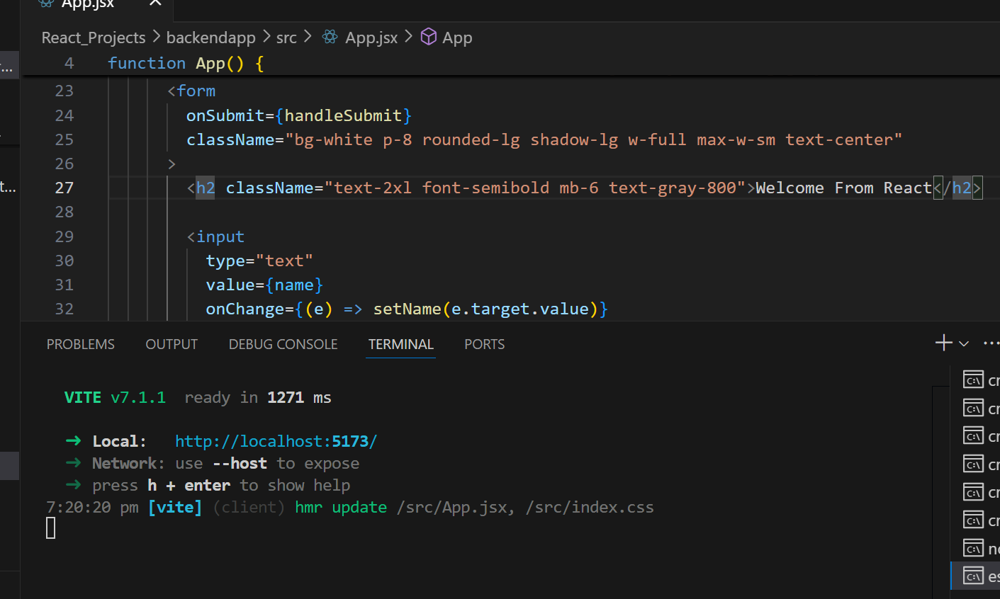
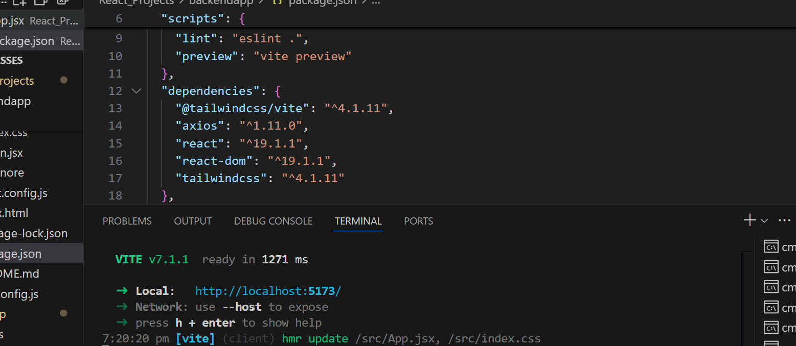

# Full Stack React + Spring Boot Application

This project is a full stack web application featuring a **React** frontend, **Spring Boot** backend REST API, **Axios** for frontend-backend communication, and **MySQL** as the database.

---

## Technologies Used

- **Frontend:** React.js, Axios (HTTP client)
- **Backend:** Java, Spring Boot, Spring Data JPA
- **Database:** MySQL
- **Build Tools:** Maven or Gradle for backend, npm for frontend

---

## Project Structure

- `frontend/` — React application handling user interface and client-side logic.
- `backend/` — Spring Boot REST API managing business logic and database interactions.
- `projectimages/` — Contains screenshots and images related to the project.

---

## Setup Instructions

1. **Configure MySQL Database:**

   - Create a new database and user with appropriate privileges.
   - Update backend configuration to connect with your MySQL database.

2. **Run Backend:**

   - Build and start the Spring Boot backend server.
   - Backend exposes REST endpoints for the frontend to consume.

3. **Run Frontend:**

   - Install dependencies and start the React application.
   - The frontend communicates with backend APIs via Axios.

4. **CORS Configuration:**

   - Ensure backend allows cross-origin requests from the React frontend origin.

---
5 Sample Images

- Use **relative paths** if images are inside your repo folders:

Welcome, Render from React  
  

BackEnd Response from Spring Boot  
  

Sample codes  
  

Sample codes  
  

Sample codes  
  

